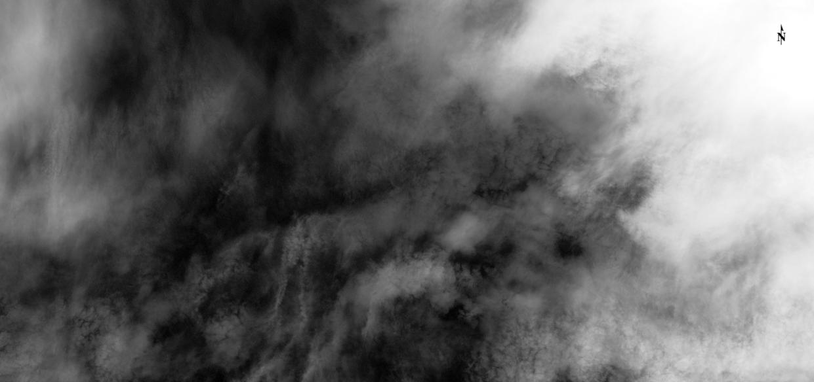
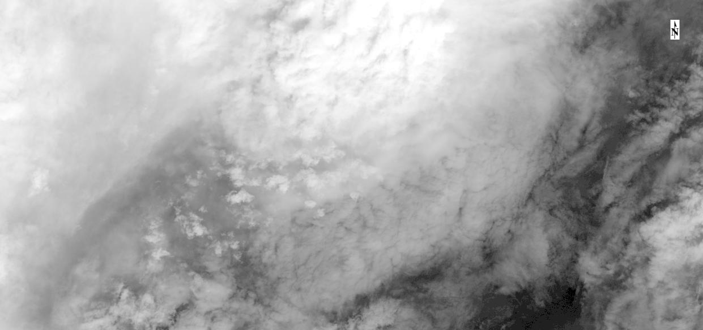
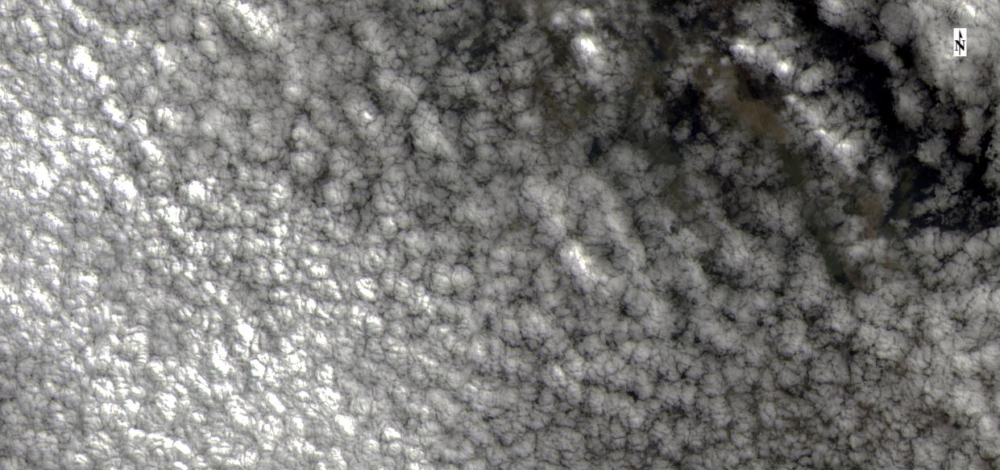
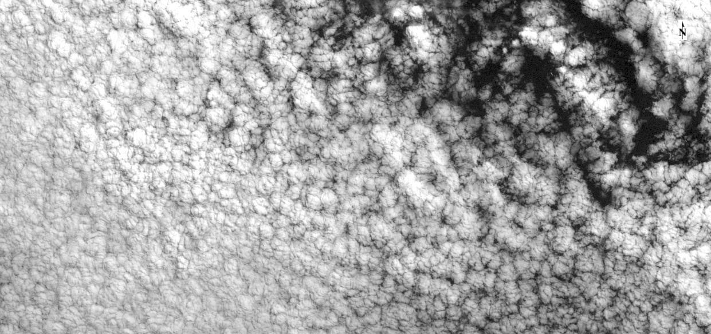
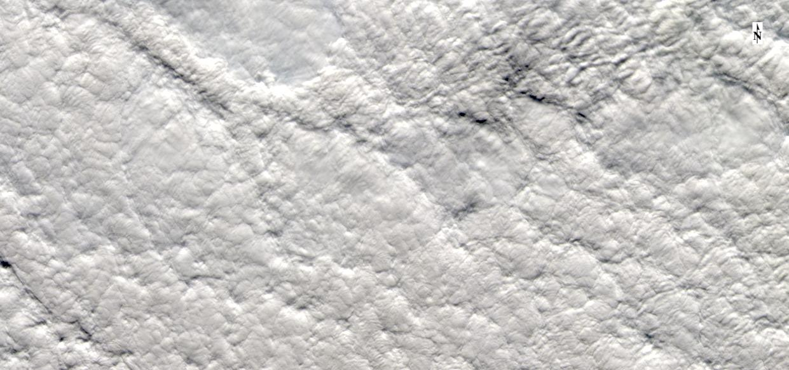
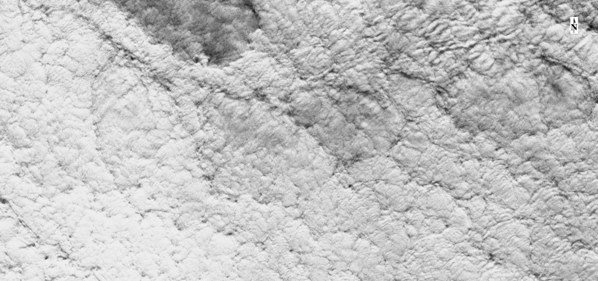

	<link rel="stylesheet" href="https://cdn.jsdelivr.net/gh/qsly09/cmpl8bands@1.0/css/reset.css"> <!-- CSS reset -->
	<link rel="stylesheet" href="https://cdn.jsdelivr.net/gh/qsly09/cmpl8bands@1.0/css/style.css"> <!-- Resource style -->
	 <!-- Modernizr -->
  	
	 
	<figure class="cd-image-container">
	
<b style="color:black"> This page is to illustrate the alignment of Landsat 8 Cirrus Band and Optical Bands (e.g., Red, Green, and Blue) for clouds. There are a total of 12 examples. We randomly selected them from the Landsat 8 data with cloud cover > 50% over the word (random dates and random locations) (Figure 1); and for each image we showed the central subset with 1241 pixels X 584 pixels (to fit the size of the commonly used screen). We observed most of clouds (including cirrus clouds and non-cirrus clouds) have very slight (and even none) displacements between different bands.</b>

	 
	 
	

	
<b style="color:black"> In each example, users can drag the middle red buttion to compare Landsat 8 Cirrus Band (Left) and ture color image composited by Red, Green, and Blue Bands (Right)</b>
	

    </figure> <!-- cd-image-container -->
	 
    
 <b>Figure 1 --- Distribution of 12 Randomly Selected Landsat 8 Images (Red Points) &darr;</b>

     
	<figure class="cd-image-container">
		
	</figure> <!-- cd-image-container -->
	 

    
 <b>Example 1 --- ID: LC08_L1TP_227091_20170123_20170311_01_T1 &darr;</b>

	 
	<figure class="cd-image-container">
		
		Ture Color Image

		
 <!-- the resizable image on top -->
			
			Cirrus Band
		

		
	</figure> <!-- cd-image-container -->
	 

    
 <b>Example 2 --- ID: LC08_L1TP_016034_20171016_20171024_01_T1 &darr;</b>

	 
	<figure class="cd-image-container">
		
		Ture Color Image

		
 <!-- the resizable image on top -->
			
			Cirrus Band
		

		
	</figure> <!-- cd-image-container -->
	 

    
 <b>Example 3 --- ID: LC08_L1TP_042026_20190419_20190423_01_T1 &darr;</b>

	 
	<figure class="cd-image-container">
		
		Ture Color Image

		
 <!-- the resizable image on top -->
			
			Cirrus Band
		

		
	</figure> <!-- cd-image-container -->
	 

    
 <b>Example 4 ---  ID: LC08_L1TP_183061_20171103_20171109_01_T1 &darr;</b>

	 
	<figure class="cd-image-container">
		
		Ture Color Image

		
 <!-- the resizable image on top -->
			
			Cirrus Band
		

		
	</figure> <!-- cd-image-container -->
	 

    
 <b>Example 5 ---  ID: LC08_L1TP_109028_20170113_20180204_01_T1 &darr;</b>

	 
	<figure class="cd-image-container">
		
		Ture Color Image

		
 <!-- the resizable image on top -->
			
			Cirrus Band
		

		
	</figure> <!-- cd-image-container -->
	 

    
 <b>Example 6 ---  ID: LC08_L1TP_130035_20161012_20170319_01_T1 &darr;</b>

	 
	<figure class="cd-image-container">
		
		Ture Color Image

		
 <!-- the resizable image on top -->
			
			Cirrus Band
		

		
	</figure> <!-- cd-image-container -->
	 

    
 <b>Example 7 ---  ID: LC08_L1TP_106066_20150220_20170412_01_T2 &darr;</b>

	 
	<figure class="cd-image-container">
		
		Ture Color Image

		
 <!-- the resizable image on top -->
			
			Cirrus Band
		

		
	</figure> <!-- cd-image-container -->
	 

    
 <b>Example 8 ---  ID: LC08_L1GT_197027_20190807_20190820_01_T2 &darr;</b>

	 
	<figure class="cd-image-container">
		
		Ture Color Image

		
 <!-- the resizable image on top -->
			
			Cirrus Band
		

		
	</figure> <!-- cd-image-container -->
	 

 
 <b>Example 9 ---  ID: LC08_L1TP_025040_20191021_20191030_01_T1 &darr;</b>

	 
	<figure class="cd-image-container">
		
		Ture Color Image

		
 <!-- the resizable image on top -->
			
			Cirrus Band
		

		
	</figure> <!-- cd-image-container -->
	 

	
    
 <b>Example 10 ---  ID: LC08_L1GT_011053_20140802_20170420_01_T2 &darr;</b>

	 
	<figure class="cd-image-container">
		
		Ture Color Image

		
 <!-- the resizable image on top -->
			
			Cirrus Band
		

		
	</figure> <!-- cd-image-container -->
	 

    
 <b>Example 11 ---  ID: LC08_L1TP_228077_20190901_20190916_01_T1 &darr;</b>

	 
	<figure class="cd-image-container">
		
		Ture Color Image

		
 <!-- the resizable image on top -->
			
			Cirrus Band
		

		
	</figure> <!-- cd-image-container -->
	 

    
 <b>Example 12 ---  ID: LC08_L1GT_205115_20161126_20170317_01_T2 &darr;</b>

	 
	<figure class="cd-image-container">
		
		Ture Color Image

		
 <!-- the resizable image on top -->
			
			Cirrus Band
		

		
	</figure> <!-- cd-image-container -->
	 

 <!-- Resource jQuery -->
 <!-- Resource jQuery -->

